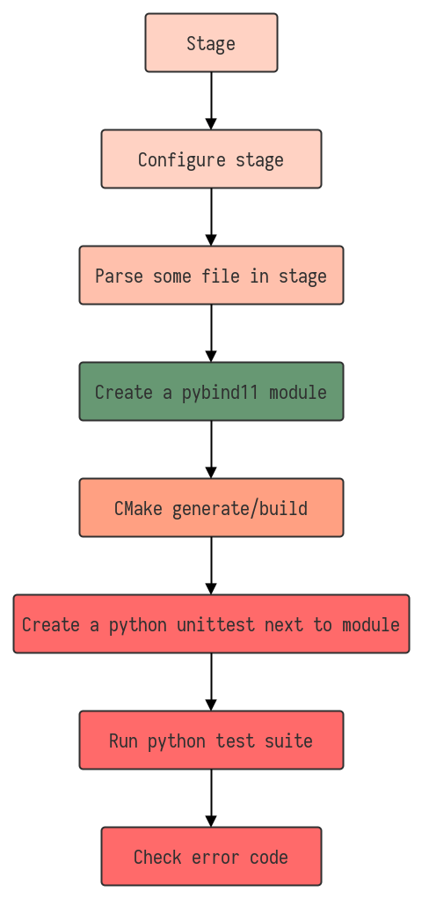

# Test overview #

`frontend.py` is a library built on top of libraries. Therefore the integration testing needs some setup. This document tries to explain the process.

## Understanding stages ##

Since `frontend.py` is a high level library, focusing on creating buildable `pybind11` modules, the tests need a realistic environment. The integration tests therefore uses the notion of a `stage`, which is a temporary copy of some provided project. To create a `stage`, you need to provide a `base stage` for it to inherit files from. This is usually located in `tests/testStage`, and the generated stages will be created at `tests/testStage/stages`.

When a stage is built you can:

* Add files
* Run commands from it

If the stage is a `CMake` project and the provided `CMakeLists.txt`:

* includes `cmake/TargetName.cmake` and uses the variable `target_name` as the target then you can
    * Set the target name
* includes `cmake/Sources.cmake` and uses the variable `sources` as the sources for the target then you can
    * Add/remove source files for the target

The default files that a `stage` inherits from the `base stage` (if they exists) are:

* `CMakeLists.txt`
    - `CMake` config file
* `cmake/*`
    - `CMake` modules
* `build/_deps/*`
    - `CMake` built downloaded dependencies

When the `stage` runs its destructor, the `stage` directory is removed. This can be overridden for debugging by setting the `m_removeOnDestruction` flag to `false`.

### Pybind11Stage ###

The `TestUtil` library contains `Pybind11Stage` which extends a normal `stage`, and adds some convenient abstractions to test `pybind11` built modules. If you don't have a reason to dig, you should probably use the `Pybind11Stage`.

## Architecture ##

Typically an integration test follows the flow described below. A `stage` is created from the `base stage` at `tests/testStage/`. A header file containing the `C++` code we want to translate into python is added to the `stage`. `Tolc::Parser` is used to produce `Tolc::IR`, that is then fed into our `frontend.py`. The frontend creates a set of `C++` files containing `pybind11` code and the `Pybind11Stage` ensures that our header is included. We then use `CMake` to generate and build our `pybind11` module. A `python` unittest is placed next to it in our `build` directory, and the `python` builtin test suite is called. As all other test suites, the `python` `unittest` module returns a non zero exit status on failure, so this is typically checked.

